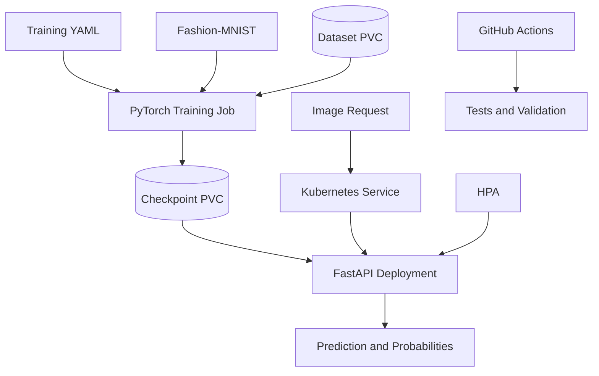

# MLOps PyTorch Pipeline

An end-to-end MLOps pipeline for training and serving a Fashion-MNIST image classifier using PyTorch, FastAPI, Docker, Kubernetes, and GitHub Actions.

## Architecture



The training workload reads version-controlled YAML configuration, downloads Fashion-MNIST, emits structured JSON-line metrics, and saves the best checkpoint. Separate persistent volumes store the dataset and trained checkpoint. The serving workload loads the checkpoint and exposes health and prediction endpoints. Kubernetes provides persistent storage, resource controls, probes, service discovery, rolling updates, and horizontal autoscaling.

## Features

- Fashion-MNIST CNN implemented in PyTorch
- Reproducible YAML-based training configuration
- Training and validation DataLoaders
- Structured JSON-line training metrics
- Configurable checkpoint saving
- Early stopping support
- FastAPI inference service
- `/health` and `/predict` endpoints
- Separate training and serving Docker images
- Slim Python base images
- Non-root serving container
- Docker health check
- Kubernetes training Job and ConfigMap
- Separate persistent volumes for training data and checkpoints
- Two-replica serving Deployment
- ClusterIP Service
- Readiness and liveness probes
- Rolling-update deployment strategy
- CPU-based HorizontalPodAutoscaler
- GitHub Actions test and validation workflow
- Feature-branch and pull-request development workflow

## Repository Structure

```text
mlops-pytorch-pipeline/
├── .github/
│   └── workflows/
│       └── ci.yml
├── configs/
│   └── training_config.yaml
├── docker/
│   ├── Dockerfile.train
│   └── Dockerfile.serve
├── docs/
│   ├── reflection.md
│   ├── validation.md
│   └── screenshots/
├── k8s/
│   ├── configmap.yaml
│   ├── hpa.yaml
│   ├── namespace.yaml
│   ├── pvc.yaml
│   ├── serving-deployment.yaml
│   ├── serving-service.yaml
│   └── training-job.yaml
├── requirements/
│   ├── serve.txt
│   └── train.txt
├── src/
│   ├── dataset.py
│   ├── model.py
│   ├── serve.py
│   └── train.py
├── tests/
│   └── test_model.py
├── .dockerignore
├── .gitignore
└── README.md
```

## Prerequisites

- Python 3.11 or later
- Git
- Docker Desktop
- `kubectl`
- Minikube
- GitHub CLI

## Local Setup

Run these commands from the repository root.

### Windows PowerShell

```powershell
python -m venv .venv
Set-ExecutionPolicy -Scope Process -ExecutionPolicy RemoteSigned
.\.venv\Scripts\Activate.ps1
python -m pip install --upgrade pip
python -m pip install -r requirements\train.txt -r requirements\serve.txt
```

## Run Unit Tests

```powershell
python -m pytest -q
```

Expected result:

```text
2 passed
```

## Train Locally

```powershell
python src\train.py
```

The training process emits JSON-line events such as:

```json
{"event":"epoch_completed","epoch":2,"training_loss":0.307934,"validation_loss":0.275261,"validation_accuracy":0.8994}
```

The best model is saved as:

```text
checkpoints/classifier_v1.pt
```

## Run the API Locally

```powershell
python -m uvicorn src.serve:app --host 127.0.0.1 --port 8080
```

Health check:

```powershell
curl.exe http://127.0.0.1:8080/health
```

Prediction:

```powershell
curl.exe -X POST http://127.0.0.1:8080/predict -F "image=@data/test_image.png"
```

The prediction response contains the predicted class, class index, and probabilities for all ten Fashion-MNIST classes.

## Docker

### Validate Dockerfiles

```powershell
docker build --check -f docker/Dockerfile.train .
docker build --check -f docker/Dockerfile.serve .
```

### Build Images

```powershell
docker build -f docker/Dockerfile.train -t mlops-train:v1 .
docker build -f docker/Dockerfile.serve -t mlops-serve:v1 .
```

### Run Containerized Training

```powershell
docker run --rm -v "${PWD}/data:/app/data" -v "${PWD}/checkpoints:/app/checkpoints" mlops-train:v1
```

### Run the Serving Container

```powershell
docker run --rm --name mlops-serve -p 8080:8080 -v "${PWD}/checkpoints:/app/checkpoints:ro" mlops-serve:v1
```

Test the container using:

```powershell
curl.exe http://127.0.0.1:8080/health
curl.exe -X POST http://127.0.0.1:8080/predict -F "image=@data/test_image.png"
```

## Kubernetes with Minikube

### Start the Cluster

```powershell
minikube start --driver=docker --cpus=4 --memory=8192
minikube addons enable metrics-server
```

### Load Local Docker Images

Docker Desktop and Minikube maintain separate image stores. Load both local images into Minikube:

```powershell
minikube image load mlops-train:v1
minikube image load mlops-serve:v1
```

Verify:

```powershell
minikube image ls | Select-String "mlops-train"
minikube image ls | Select-String "mlops-serve"
```

### Validate Kubernetes Manifests

```powershell
kubectl apply --dry-run=client -f k8s\
```

The validation should report eight resources because `pvc.yaml` contains separate claims for training data and model checkpoints.

### Deploy Training Resources

```powershell
kubectl apply -f k8s\namespace.yaml
kubectl apply -f k8s\configmap.yaml
kubectl apply -f k8s\pvc.yaml
kubectl apply -f k8s\training-job.yaml
```

Follow the training log:

```powershell
kubectl logs -n ml-training job/fashion-mnist-training -f
```

Verify the Job, pod, and persistent volumes:

```powershell
kubectl get jobs,pods,pvc -n ml-training
```

Expected results:

- Training Job: `Complete 1/1`
- Training pod: `Completed`
- `training-data-pvc`: `Bound`
- `model-checkpoints-pvc`: `Bound`

### Deploy Serving Resources

```powershell
kubectl apply -f k8s\serving-deployment.yaml
kubectl apply -f k8s\serving-service.yaml
kubectl apply -f k8s\hpa.yaml
```

Wait for the two-replica Deployment:

```powershell
kubectl rollout status deployment/model-serving -n ml-training --timeout=240s
```

### Inspect Kubernetes Resources

```powershell
kubectl get deployments,pods,services -n ml-training
kubectl get hpa -n ml-training
```

Expected serving state:

- Deployment: `2/2` available
- Two serving pods: `1/1 Running`
- ClusterIP Service: port `80`
- HPA: minimum `2`, maximum `4`
- HPA target CPU utilization: `70%`

### Test the Kubernetes API

Start port forwarding in one terminal:

```powershell
kubectl port-forward -n ml-training service/model-serving 8080:80
```

In a second PowerShell terminal, run:

```powershell
curl.exe http://127.0.0.1:8080/health
```

```powershell
curl.exe -X POST http://127.0.0.1:8080/predict -F "image=@data/test_image.png"
```

The health endpoint should return a healthy status. The prediction endpoint should return the predicted class, class index, and probabilities for all ten classes.

## Kubernetes Specification

### Training Job

- Namespace: `ml-training`
- ConfigMap mounted at `/app/configs`
- Dataset PVC mounted at `/app/data`
- Checkpoint PVC mounted at `/app/checkpoints`
- CPU request and limit: `2`
- Memory request and limit: `4Gi`

### Serving Deployment

- Replicas: `2`
- Checkpoint PVC mounted read-only
- Non-root user
- Liveness probe: `/health` every 10 seconds
- Readiness probe: `/health` every 5 seconds after a 15-second delay
- Requests: `500m` CPU and `1Gi` memory
- Limits: `1` CPU and `2Gi` memory
- Rolling update: `maxSurge: 1`, `maxUnavailable: 0`

### Serving Service and HPA

- ClusterIP Service: port `80` targeting container port `8080`
- HPA minimum replicas: `2`
- HPA maximum replicas: `4`
- Target CPU utilization: `70%`

## CI/CD

GitHub Actions runs on pushes and pull requests targeting `main` or `develop`. The workflow:

1. Installs pinned training and serving dependencies.
2. Runs unit tests.
3. Checks Python syntax.
4. Validates configuration and Kubernetes YAML.
5. Checks both Dockerfiles.

Workflow file:

```text
.github/workflows/ci.yml
```

## Validation Results

| Validation | Result |
|---|---|
| Unit tests | 2 passed |
| Dockerfile checks | No warnings |
| Docker training | Completed 2 epochs |
| Best validation loss | 0.275261 |
| Validation accuracy | 89.94% |
| Checkpoint | `classifier_v1.pt` saved |
| Container `/health` | HTTP 200 |
| Container `/predict` | HTTP 200 |
| Kubernetes manifest dry-run | Eight resources validated |
| Kubernetes training Job | Complete 1/1 |
| Training data PVC | Bound, 2Gi |
| Checkpoint PVC | Bound, 1Gi |
| Kubernetes Deployment | 2/2 available |
| Kubernetes Service | ClusterIP, port 80 |
| Kubernetes HPA | CPU metrics available, 2–4 replicas |
| Kubernetes `/health` | HTTP 200 |
| Kubernetes `/predict` | HTTP 200 |

Complete terminal evidence is available in:

```text
docs/validation.md
```

## Development Workflow

All development was completed using feature branches and pull requests into `develop`, followed by release integration into `main`.

| PR | Scope |
|---|---|
| [PR #1](https://github.com/belherohan-iitmda25m555/mlops-pytorch-pipeline/pull/1) | PyTorch model and training pipeline |
| [PR #2](https://github.com/belherohan-iitmda25m555/mlops-pytorch-pipeline/pull/2) | FastAPI model-serving API |
| [PR #3](https://github.com/belherohan-iitmda25m555/mlops-pytorch-pipeline/pull/3) | Docker containerization |
| [PR #4](https://github.com/belherohan-iitmda25m555/mlops-pytorch-pipeline/pull/4) | Kubernetes deployment |
| [PR #5](https://github.com/belherohan-iitmda25m555/mlops-pytorch-pipeline/pull/5) | GitHub Actions CI |
| [PR #6](https://github.com/belherohan-iitmda25m555/mlops-pytorch-pipeline/pull/6) | Documentation, validation evidence, and reflection |
| [PR #7](https://github.com/belherohan-iitmda25m555/mlops-pytorch-pipeline/pull/7) | Initial release integration |

## API Endpoints

### `GET /health`

Returns the service status and configured checkpoint path.

Example:

```json
{
  "status": "healthy",
  "model_path": "/app/checkpoints/classifier_v1.pt"
}
```

### `POST /predict`

Accepts a grayscale image as multipart form data and returns:

- Predicted Fashion-MNIST class
- Predicted class index
- Probabilities for all ten Fashion-MNIST classes

## Project Reflection

The complete 300–500 word reflection is available in:

```text
docs/reflection.md
```

## AI-Assistance Disclosure

OpenAI ChatGPT was used as a learning and review assistant for project planning, command guidance, debugging, and rubric verification. All generated suggestions were reviewed, tested, adapted, and validated by the repository author. The author is responsible for the final implementation and is prepared to explain every component during a code review.

## License

This repository was created as an individual academic MLOps assignment.