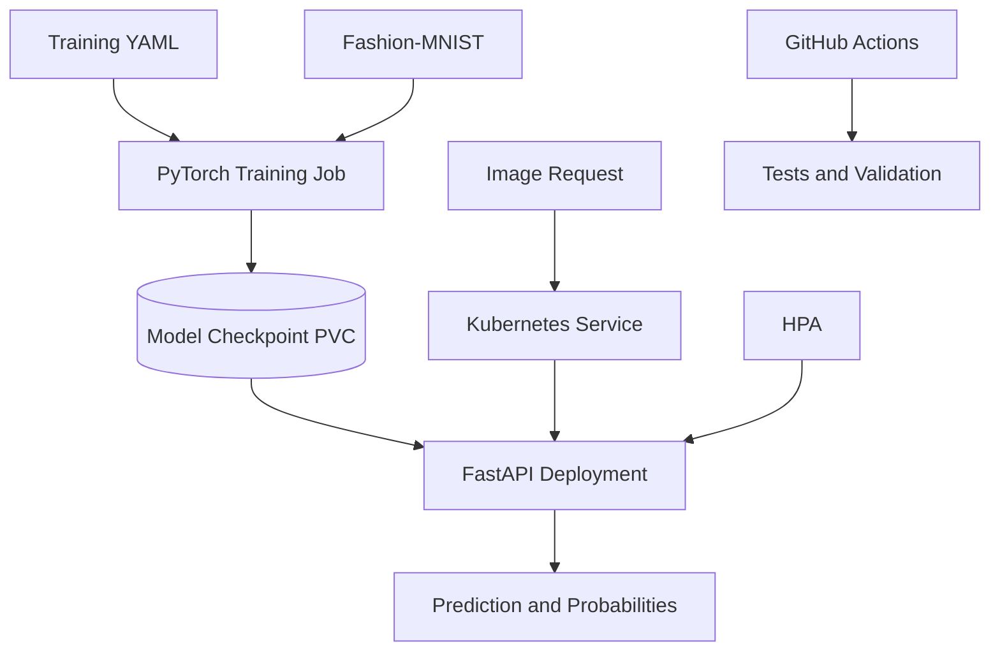

# MLOps PyTorch Pipeline

An end-to-end MLOps pipeline for training and serving a Fashion-MNIST image classifier using PyTorch, FastAPI, Docker, Kubernetes, and GitHub Actions.

## Architecture



The training workload reads version-controlled YAML configuration, downloads Fashion-MNIST, emits structured JSON-line metrics, and saves the best checkpoint. The serving workload loads that checkpoint and exposes health and prediction endpoints. Kubernetes provides persistent storage, resource controls, probes, service discovery, and horizontal autoscaling.

## Features

- Fashion-MNIST CNN implemented in PyTorch
- Reproducible YAML-based training configuration
- Training and validation DataLoaders
- Structured JSON-line training metrics
- Configurable checkpoint saving
- Early stopping support
- FastAPI inference service
- `/health` and `/predict` endpoints
- Separate training and serving Docker images
- Slim Python base images
- Non-root serving container
- Docker health check
- Kubernetes training Job and ConfigMap
- Persistent checkpoint storage
- Serving Deployment and ClusterIP Service
- Readiness and liveness probes
- CPU-based HorizontalPodAutoscaler
- GitHub Actions test and validation workflow
- Feature-branch and pull-request development workflow

## Repository Structure

```text
mlops-pytorch-pipeline/
├── .github/
│   └── workflows/
│       └── ci.yml
├── configs/
│   └── training_config.yaml
├── docker/
│   ├── Dockerfile.train
│   └── Dockerfile.serve
├── docs/
│   └── screenshots/
├── k8s/
│   ├── configmap.yaml
│   ├── hpa.yaml
│   ├── namespace.yaml
│   ├── pvc.yaml
│   ├── serving-deployment.yaml
│   ├── serving-service.yaml
│   └── training-job.yaml
├── requirements/
│   ├── serve.txt
│   └── train.txt
├── src/
│   ├── dataset.py
│   ├── model.py
│   ├── serve.py
│   └── train.py
├── tests/
│   └── test_model.py
├── .dockerignore
├── .gitignore
└── README.md
```

## Prerequisites

- Python 3.11 or later
- Git
- Docker Desktop
- `kubectl`
- Minikube
- GitHub CLI (optional)

## Local Setup

Run these commands from the repository root.

### Windows PowerShell

```powershell
python -m venv .venv
Set-ExecutionPolicy -Scope Process -ExecutionPolicy RemoteSigned
.\.venv\Scripts\Activate.ps1
python -m pip install --upgrade pip
python -m pip install -r requirements\train.txt -r requirements\serve.txt
```

## Run Unit Tests

```powershell
python -m pytest -q
```

Expected result:

```text
2 passed
```

## Train Locally

```powershell
python src\train.py
```

The training process emits JSON-line events such as:

```json
{"event":"epoch_completed","epoch":2,"training_loss":0.307934,"validation_loss":0.275261,"validation_accuracy":0.8994}
```

The best model is saved as:

```text
checkpoints/classifier_v1.pt
```

## Run the API Locally

```powershell
python -m uvicorn src.serve:app --host 127.0.0.1 --port 8080
```

Health check:

```powershell
curl.exe http://127.0.0.1:8080/health
```

Prediction:

```powershell
curl.exe -X POST http://127.0.0.1:8080/predict -F "image=@data/test_image.png"
```

The prediction response contains the predicted class, class index, and probabilities for all ten Fashion-MNIST classes.

## Docker

### Validate Dockerfiles

```powershell
docker build --check -f docker/Dockerfile.train .
docker build --check -f docker/Dockerfile.serve .
```

### Build Images

```powershell
docker build -f docker/Dockerfile.train -t mlops-train:v1 .
docker build -f docker/Dockerfile.serve -t mlops-serve:v1 .
```

### Run Containerized Training

```powershell
docker run --rm -v "${PWD}/data:/app/data" -v "${PWD}/checkpoints:/app/checkpoints" mlops-train:v1
```

### Run the Serving Container

```powershell
docker run --rm --name mlops-serve -p 8080:8080 -v "${PWD}/checkpoints:/app/checkpoints:ro" mlops-serve:v1
```

Test the container using the same `/health` and `/predict` commands shown above.

## Kubernetes with Minikube

### Start the Cluster

```powershell
minikube start --driver=docker --cpus=4 --memory=8192
minikube addons enable metrics-server
```

### Load Local Images

```powershell
minikube image load mlops-train:v1
minikube image load mlops-serve:v1
```

### Validate Manifests

```powershell
kubectl apply --dry-run=client -f k8s\
```

### Deploy Training Resources

```powershell
kubectl apply -f k8s\namespace.yaml
kubectl apply -f k8s\configmap.yaml
kubectl apply -f k8s\pvc.yaml
kubectl apply -f k8s\training-job.yaml
kubectl logs -n mlops job/fashion-mnist-training -f
```

### Deploy Serving Resources

```powershell
kubectl apply -f k8s\serving-deployment.yaml
kubectl apply -f k8s\serving-service.yaml
kubectl apply -f k8s\hpa.yaml
kubectl rollout status deployment/fashion-mnist-serving -n mlops
```

### Inspect Kubernetes Resources

```powershell
kubectl get jobs,pods,pvc -n mlops
kubectl get deployments,services -n mlops
kubectl get hpa -n mlops
```

### Test the Kubernetes API

Start port forwarding:

```powershell
kubectl port-forward -n mlops service/fashion-mnist-serving 8080:8080
```

In a second terminal:

```powershell
curl.exe http://127.0.0.1:8080/health
curl.exe -X POST http://127.0.0.1:8080/predict -F "image=@data/test_image.png"
```

## CI/CD

GitHub Actions runs on pushes and pull requests targeting `main` or `develop`. The workflow:

1. Installs pinned training and serving dependencies.
2. Runs unit tests.
3. Checks Python syntax.
4. Validates configuration and Kubernetes YAML.
5. Checks both Dockerfiles.

Workflow file: `.github/workflows/ci.yml`

## Validation Results

| Validation | Result |
|---|---|
| Unit tests | 2 passed |
| Dockerfile checks | No warnings |
| Docker training | Completed 2 epochs |
| Best validation loss | 0.275261 |
| Validation accuracy | 89.94% |
| Checkpoint | `classifier_v1.pt` saved |
| Container `/health` | HTTP 200 |
| Container `/predict` | HTTP 200 |
| Kubernetes training Job | Completed |
| Kubernetes Deployment | 1/1 available |
| Kubernetes HPA | CPU metrics available, target 70% |
| Kubernetes `/health` | HTTP 200 |
| Kubernetes `/predict` | HTTP 200 |

## Development Workflow

Development was performed through isolated feature branches and pull requests into `develop`.

| PR | Scope |
|---|---|
| [PR #1](https://github.com/belherohan-iitmda25m555/mlops-pytorch-pipeline/pull/1) | PyTorch model and training pipeline |
| [PR #2](https://github.com/belherohan-iitmda25m555/mlops-pytorch-pipeline/pull/2) | FastAPI model-serving API |
| [PR #3](https://github.com/belherohan-iitmda25m555/mlops-pytorch-pipeline/pull/3) | Docker containerization |
| [PR #4](https://github.com/belherohan-iitmda25m555/mlops-pytorch-pipeline/pull/4) | Kubernetes deployment |
| [PR #5](https://github.com/belherohan-iitmda25m555/mlops-pytorch-pipeline/pull/5) | GitHub Actions CI |

## API Endpoints

### `GET /health`

Returns the service status and configured checkpoint path.

### `POST /predict`

Accepts a grayscale image as multipart form data and returns:

- Predicted Fashion-MNIST class
- Predicted class index
- Probabilities for all ten classes

## License

This repository was created as an individual academic MLOps assignment.